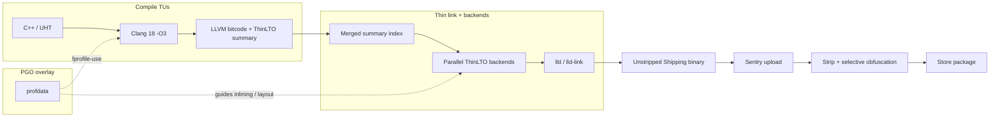
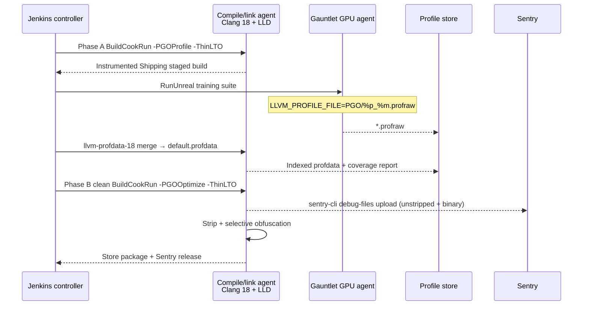
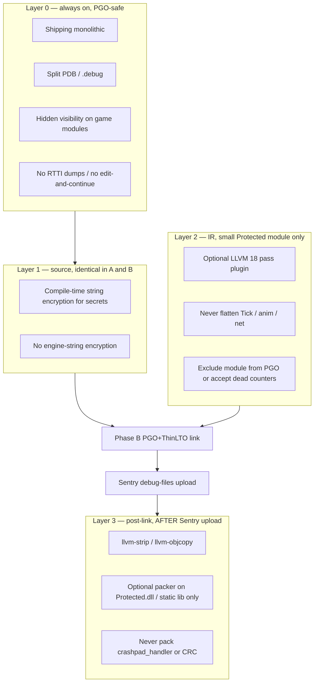
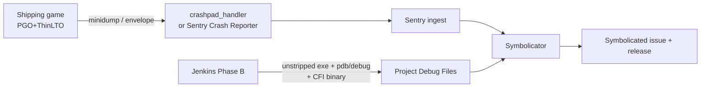
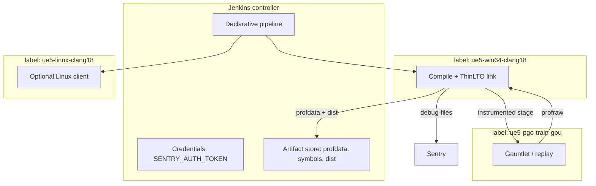

# UE5 + Clang 18: PGO, ThinLTO, Obfuscation, and Sentry on Jenkins

This is the production recipe for a **Shipping, monolithic, Clang 18** Unreal Engine 5 client that is:

1. **Profile-guided** (IR-PGO) so hot paths, inlining, and block layout match real gameplay.
2. **ThinLTO-linked** so cross-TU inlining is cheap enough to run on a CI farm.
3. **Obfuscated without poisoning PGO or breaking crash symbolication**.
4. **Reported through Sentry** (Sentry Crash Reporter + debug-file upload).

Start on **Clang 18.1.x**. Epic’s own Win64 Clang work reports faster compile, faster link, and faster execution on Clang 18 and Clang 20, with a Clang 19 regression. Pin 18 until you have A/B numbers on 20.

Do **not** enable MSVC `/LTCG` / `.pgd` PGO in this pipeline. Clang and MSVC profile formats are incompatible.

---

## 1. What each knob actually does

| Knob | Compiler / UBT name | What it changes | When it is worth the cost |
|---|---|---|---|
| **PGO (IR)** | Clang `-fprofile-generate` / `-fprofile-use`; UBT `bPGOProfile` / `bPGOOptimize` | Counter-based edge/block weights drive inlining, splitting, layout, and ICF | CPU-bound game code. Typical UE titles see mid-single-digit to ~10% on CPU-heavy scenes when the training set is honest. |
| **ThinLTO** | Clang `-flto=thin`; UBT `bAllowLTCG` + `bPreferThinLTO` | Cross-module inlining from a compact summary index, backends run in parallel | Shipping/Test monolithic clients. Full (monolithic) LTO is slower and more RAM-heavy on a UE binary. |
| **Full LTO** | `-flto=full` | One giant module; best theoretical IPO | Rarely worth it for UE. Use only if ThinLTO is proven slower **and** you have ≥256 GB RAM on the linker node. |
| **Obfuscation** | Source-level string crypto + strip + optional IR passes on a **small** module | Raises reverse-engineering cost | Never on Engine. Never on PGO hot paths. Never after Sentry upload if you rewrite instructions. |
| **Sentry** | `sentry-native` / Sentry Crash Reporter + `sentry-cli debug-files upload` | Minidump → symbolicated stack + release health | Shipping and Test. Upload **unstripped** debug + binary **before** strip. |

**Hard compatibility rule:** Clang frontend instrumentation (`-fprofile-instr-generate`) and IR instrumentation (`-fprofile-generate`) cannot be mixed. There is no converter. This pipeline uses **IR-PGO only**.



---

## 2. Target shape (do not skip this)

PGO + LTO in Unreal only pays off on a **monolithic Shipping (or Test) game target**. Modular editor builds, live coding, and `TargetLinkType.Modular` are the wrong vehicle.

| Setting | Required value | Why |
|---|---|---|
| Target type | `TargetType.Game` (plus dedicated server if you PGO that binary separately) | Editor is not the shipping hot path. |
| Link type | `TargetLinkType.Monolithic` | Linux UBT **rejects** LTO on modular (`lld` is not used for UE dylibs). Windows Clang LTO/PGO also expects a single link. |
| Configuration | `Shipping` for store; `Test` for the instrumented trainer if you need `stat`/`automation` | Training and optimize **must use the same configuration**. |
| Compiler | Clang **18.1.x** | Pin the exact patch. Profile files are toolchain-sensitive. |
| Linker | LLD (`bAllowClangLinker = true` on Windows) | Required whenever LTCG or PGO is on with Clang/ICX. MSVC `link.exe` cannot consume Clang bitcode + LLVM profiles. |
| UBA | Off for PGO links (`-noUBA`) | Unreal Build Accelerator currently corrupts PGO link on 5.7.x; workaround is `-UBTArgs=-noUBA` until 5.8. |
| Incremental link | Off | LTCG/PGO and incremental linking fight each other. |

Linux UBT also **forces LTO on** if either `bPGOProfile` or `bPGOOptimize` is set. Plan RAM accordingly.

---

## 3. Toolchain: Clang 18 on UE5

### 3.1 Pin the compiler

**Windows (Clang-cl + lld-link)**

Install LLVM 18.1.8 (or the Epic-supported 18.x that your engine version lists). Then force UBT:

```xml
<?xml version="1.0" encoding="utf-8" ?>
<Configuration xmlns="https://www.unrealengine.com/BuildConfiguration">
  <WindowsPlatform>
    <Compiler>Clang</Compiler>
    <CompilerVersion>18.1.8</CompilerVersion>
    <bAllowClangLinker>true</bAllowClangLinker>
  </WindowsPlatform>
  <BuildConfiguration>
    <bAllowLTCG>true</bAllowLTCG>
    <bPreferThinLTO>true</bPreferThinLTO>
  </BuildConfiguration>
</Configuration>
```

Search order for this file (first hit wins per-key):

1. `<Project>/Saved/UnrealBuildTool/BuildConfiguration.xml`
2. `<Engine>/Saved/UnrealBuildTool/BuildConfiguration.xml`
3. `%APPDATA%/Unreal Engine/UnrealBuildTool/BuildConfiguration.xml`

On Jenkins, write (1) from the job so agents cannot silently fall back to MSVC.

**Linux**

```bash
# Ubuntu example — pin the 18 series
sudo apt-get install clang-18 lld-18 llvm-18
export CC=clang-18 CXX=clang++-18
```

UE Linux already uses Clang. Confirm `clang++ --version` on the agent prints 18.1.x before the build starts.

### 3.2 Confirm LLD, not `link.exe` / BFD ld

The instrumented and optimized logs must contain `lld-link` (Windows) or `ld.lld` (Linux). If you see `link.exe` while `bPGOOptimize=true`, the profile will not apply and the link may fail with a bogus `.pgd` / “invalid format” error — that path is the MSVC PGO database, not LLVM.

### 3.3 Agent sizing (ThinLTO + UE)

| Role | vCPU | RAM | Notes |
|---|---|---|---|
| Compile farm | 32–64 | 64 GB | Compile is bitcode; ThinLTO cache on fast SSD. |
| Linker / ThinLTO backend | 32–64 | **128 GB minimum**, 256 GB if you try full LTO | ThinLTO backends default to one thread per logical core. Cap jobs if the node thrashes. |
| Gauntlet trainer | GPU node matching min-spec + target-spec | 32 GB | Instrumented Shipping is slower; budget 2–4× wall time. |

ThinLTO cache (highly recommended on CI):

| Linker | Cache flag |
|---|---|
| `lld-link` | `/lldltocache:<dir>` |
| ELF `ld.lld` | `-Wl,--thinlto-cache-dir=<dir>` |
| Job cap | `lld-link /opt:lldltojobs=N` or `-Wl,--thinlto-jobs=N` |

UBT exposes `ThinLTOCacheDirectory` and `ThinLTOCachePruningArguments` on `TargetRules`. Point them at a **per-engine-SHA, per-clang-version** cache, not a shared dirty disk.

---

## 4. UBT flags — instrument vs optimize

Drive these from Jenkins via **command line**, not by committing `bPGOOptimize = true` into `Target.cs`. That prevents a developer from accidentally shipping an instrumented or profile-stale binary.

`TargetRules` already maps:

| CLI | Field |
|---|---|
| `-LTCG` | `bAllowLTCG` |
| `-ThinLTO` | `bPreferThinLTO` |
| `-PGOProfile` | `bPGOProfile` |
| `-PGOOptimize` | `bPGOOptimize` |
| `-ClangLinker` | `WindowsPlatform.bAllowClangLinker` |
| `-ThinLTOCacheDirectory=` | cache path |
| `-noUBA` (via `-UBTArgs`) | disable Unreal Build Accelerator |

`PGODirectory` and `PGOFilenamePrefix` are the platform-specific profile location and name prefix. Set them to a **stable, clean path** on the agent, for example:

```
%WORKSPACE%/PGO/clang18/%ENGINE_SHA%/%GAME_SHA%/
```

### 4.1 Target.cs baseline (always on for Shipping)

```csharp
public class MyGameTarget : TargetRules
{
    public MyGameTarget(TargetInfo Target) : base(Target)
    {
        Type = TargetType.Game;
        LinkType = TargetLinkType.Monolithic;
        DefaultBuildSettings = BuildSettingsVersion.Latest;

        if (Target.Configuration == UnrealTargetConfiguration.Shipping
            || Target.Configuration == UnrealTargetConfiguration.Test)
        {
            bAllowLTCG = true;
            bPreferThinLTO = true;
            WindowsPlatform.bAllowClangLinker = true;
            WindowsPlatform.Compiler = WindowsCompiler.Clang;
            WindowsPlatform.CompilerVersion = "18.1.8";

            // Split debug so we can upload then strip.
            bUsePDBFiles = true;
            bOmitFramePointers = false; // keep FP for Sentry CFI on optimized code

            PGODirectory = System.Environment.GetEnvironmentVariable("UE_PGO_DIR");
            PGOFilenamePrefix = "MyGame-Win64-Shipping";
        }

        ExtraModuleNames.Add("MyGame");
    }
}
```

Jenkins then adds **exactly one** of `-PGOProfile` or `-PGOOptimize`. Never both.

### 4.2 BuildCookRun invocations

**Phase A — instrumented trainer (never ship this):**

```bat
Engine\Build\BatchFiles\RunUAT.bat BuildCookRun ^
  -project="%WORKSPACE%\MyGame.uproject" ^
  -platform=Win64 -clientconfig=Shipping ^
  -build -cook -stage -pak -prereqs ^
  -ubtargs="-LTCG -ThinLTO -PGOProfile -ClangLinker -noUBA" ^
  -utf8output
```

**Phase B — optimized store binary:**

```bat
Engine\Build\BatchFiles\RunUAT.bat BuildCookRun ^
  -project="%WORKSPACE%\MyGame.uproject" ^
  -platform=Win64 -clientconfig=Shipping ^
  -build -cook -stage -pak -prereqs -archive -archivedirectory="%WORKSPACE%\Dist" ^
  -ubtargs="-LTCG -ThinLTO -PGOOptimize -ClangLinker -noUBA" ^
  -utf8output
```

Linux is the same with `-platform=Linux` and the engine’s Linux toolchain.

Clean `Binaries/`, `Intermediate/Build/`, and any leftover `.profraw` / `.pgd` / `.pgc` between Phase A and Phase B. A leftover MSVC `.pgd` is how teams get `fatal error C1301: read database … invalid format`.

---

## 5. PGO in three phases (Clang 18 IR-PGO)



### 5.1 Why IR-PGO, not frontend PGO, not MSVC sample PGO

Clang 18 documents two instrumentation families:

- **IR-PGO** (`-fprofile-generate` / `-fprofile-use`): counters inserted on LLVM IR. Lower overhead, smaller raw profiles, **best runtime**. This is what you want for a game.
- **Frontend PGO / coverage** (`-fprofile-instr-generate`): better source correlation, worse performance. Use it for coverage reports, not for the store binary.
- **Sample / AutoFDO** (`-fprofile-sample-use`): hardware samples. Intel’s UE 5.4+ HWPGO path is a different compiler. Do not mix those profiles with Clang IR-PGO.

UBT’s `bPGOProfile` / `bPGOOptimize` on a Clang toolchain map onto the IR-PGO pair. Do not add extra `-fprofile-instr-*` flags in a `.Build.cs`.

### 5.2 Training set — this is the optimization

PGO is only as good as the counters. Garbage training produces a Shipping binary that is **slower** than a non-PGO ThinLTO build (cold-code marking + wrong inlining).

Collect **representative, weighted** traces:

| Slice | What to drive | Weight |
|---|---|---|
| Boot + frontend | Login, title, first load | 1 |
| Worst CPU scenes | Your known hitch maps / AI swarms | 10 |
| Combat / ability pipeline | Highest instruction retirement | 8 |
| Streaming / world partition | Typical travel path | 5 |
| UI / inventory | If those are CPU-visible | 2 |
| Replay of live matches | Best “real users” proxy | 8 |

Drive this with **Gauntlet**, not a human clicking the instrumented client (too slow, not repeatable).

```bat
set LLVM_PROFILE_FILE=%UE_PGO_DIR%\raw\%p_%m.profraw

Engine\Build\BatchFiles\RunUAT.bat RunUnreal ^
  -project="%WORKSPACE%\MyGame.uproject" ^
  -platform=Win64 -configuration=Shipping ^
  -build=local ^
  -ClientExecCmds="Automation RunTests Filter:PGOTraining;Quit"
```

`%p` (PID) and `%m` (profile merge ID) prevent concurrent trainers from clobbering one file. IR-PGO’s `-fprofile-generate=<dir>` already enables raw-profile auto-merge; still use unique names on a farm.

**Instrumented FPS will be poor.** That is expected. Do not “optimize the trainer.” Optimize the **scenario coverage**. Multiple replays can be merged into one `profdata`.

### 5.3 Merge (mandatory even for one file)

Raw `*.profraw` is not usable. Index it with the **same** LLVM 18 `llvm-profdata`:

```bash
llvm-profdata-18 merge \
  --num-threads=0 \
  --weighted-input=10,hot_combat.profraw \
  --weighted-input=8,live_replay.profraw \
  --weighted-input=1,boot.profraw \
  -output="${UE_PGO_DIR}/default.profdata"
```

Do **not** pass `-sparse`. Sparse merge is for coverage reports and drops zero-count functions that PGO still needs.

Sanity checks before Phase B:

```bash
llvm-profdata-18 show --all-functions default.profdata | head
llvm-profdata-18 show --detailed-summary default.profdata
```

Reject the build if the profile is tiny, or if `llvm-profdata` reports a version mismatch (you mixed Clang 18 and 19, or frontend vs IR).

### 5.4 Profile lifetime

A `profdata` is valid for **one** `(engine SHA, game C++ SHA, clang 18 patch, Shipping/Test, Win64/Linux)` tuple.

| Change | Action |
|---|---|
| Blueprint / content only | Reuse profile. Recook, do not re-instrument. |
| Hot-path C++ (animation, AI, net, renderer hooks) | Flush and retrain. |
| Engine upgrade or Clang patch | Flush and retrain. |
| Target.cs / optimization flags | Flush and retrain. |

Store profiles as a Jenkins artifact named:

```
pgo-clang18-<engine>-<game>-<platform>-<config>.profdata
```

Do not check large profiles into git.

### 5.5 Optional: context-sensitive PGO (second instrumentation)

Clang 18 supports a **CS-PGO** second pass (`-fcs-profile-generate` after `-fprofile-use`). It improves inlining context at ~2× training cost. Enable it only after plain IR-PGO is stable and you still have a measured CPU gap. UBT does not expose this as a first-class flag; treat it as a later experiment, not the starting pipeline.

---

## 6. ThinLTO settings that stay out of the way of PGO

Use ThinLTO on **both** Phase A and Phase B. If you instrument without LTO and optimize with LTO, inlining shapes diverge and a chunk of the profile is wasted.

Epic guidance (UE 5.6/5.7 era):

- `bPreferThinLTO = true` is the default direction as of 5.7.
- Runtime wins of up to ~10% have been reported for LTCG/ThinLTO alone.
- ThinLTO link uses more RAM than a non-LTO link; measure, do not guess.

Keep frame pointers **on** for Shipping (`bOmitFramePointers = false`). PGO + ThinLTO already omit a lot of prologues; Sentry needs CFI and you want a reliable walk on optimized code. The perf cost of frame pointers is small next to a bad profile.

---

## 7. Obfuscation that does not fight the optimizer



### 7.1 What to obfuscate in an Unreal game

The engine is already public. Obfuscating `Engine`, `Core`, `RenderCore`, or this repo’s `HybridMessageRouter` buys nothing and wrecks PGO.

Protect a **small** `Protected` game module:

- entitlement / license
- anti-tamper / anti-cheat glue
- economy / granting server-trusted constants
- secret endpoints (and even those are better as server-side)

Everything else: optimize, strip, ship.

### 7.2 Layer 1 — compile-time strings (do this first)

Encrypt only string literals you cannot avoid shipping. The transform must be present in **both** Phase A and Phase B so IR and profiles match.

A typical pattern is an `consteval` / `constexpr` XOR or AES blob decoded into a stack buffer at use. Do not store the decoded `FString` in a static.

Do **not** run a whole-program string encryptor across UE. You will break `StaticClass()`, ini keys, and networking.

### 7.3 Layer 2 — IR passes (optional, last)

Control-flow flattening, bogus CFG, and instruction substitution:

- destroy PGO edge weights
- fight ThinLTO inlining
- inflate I-cache misses on the exact functions you wanted faster
- must be a plugin built against **LLVM 18**, not 17 or 19

If you still want them, add a pass plugin **only** on the `Protected` module via `Build.cs`:

```csharp
if (Target.Configuration == UnrealTargetConfiguration.Shipping
    && Target.bPGOOptimize)
{
    PublicAdditionalArguments.Add("-fpass-plugin=/opt/obf/UEObf18.so");
}
```

Never enable flattening on Phase A. If the pass changes CFG, Phase B cannot consume the Phase A profile for that module — exclude those TUs from PGO with a profile list, or leave PGO off for `Protected`.

### 7.4 Layer 3 — strip after upload

```bash
# 1. Copy unstripped artifacts for Sentry
cp "MyGame-Win64-Shipping.exe"  "symbols/MyGame-Win64-Shipping.exe"
cp "MyGame-Win64-Shipping.pdb"  "symbols/MyGame-Win64-Shipping.pdb"

# 2. Upload (see §8)
sentry-cli debug-files upload --wait symbols/

# 3. Strip the copy that will be packaged
llvm-objcopy-18 --strip-unneeded "MyGame-Win64-Shipping.exe"
```

On ELF:

```bash
objcopy --only-keep-debug MyGame MyGame.debug
objcopy --add-gnu-debuglink=MyGame.debug MyGame
llvm-strip-18 --strip-unneeded MyGame
```

Build-id / debug-id **must stay**. If a packer rewrites the PE/ELF header and changes the debug identifier, Sentry will show `MISSING SYMBOLS`.

**Never pack** `CrashReportClient.exe`, `Sentry.CrashReporter.exe`, or `crashpad_handler.exe`.

---

## 8. Sentry as the crash reporter

Use the **Sentry Unreal plugin** with **Sentry’s own crash capturing** (UE 5.2+ Windows: `sentry-native`). That is mutually exclusive with UE Crash Reporter Client on Windows. Sentry’s docs recommend starting with the **Sentry Crash Reporter** (plugin ≥ 1.8.0) rather than CRC.



### 8.1 Plugin + DSN

1. Install the plugin matching your UE version from [Sentry Unreal releases](https://github.com/getsentry/sentry-unreal/releases) into `Plugins/`.
2. `PublicDependencyModuleNames.Add("Sentry");`
3. Set DSN in **Project Settings → Plugins → Sentry**, or initialize explicitly.
4. Enable:
   - **Enable automatic crash capturing (Windows, UE 5.2+)**
   - **Enable Sentry Crash Reporter**
   - **Upload debug symbols automatically** *or* set `SENTRY_UPLOAD_SYMBOLS_AUTOMATICALLY=True` on Jenkins and then **still** run a manual upload after strip-prep (recommended; you control order).

```ini
; Config/DefaultEngine.ini
[/Script/Sentry.SentrySettings]
Dsn=https://<key>@o<orgId>.ingest.sentry.io/<projectId>
InitAutomatically=True
EnableAutoCrashCapturing=True
EnableExternalCrashReporter=True
UploadSymbolsAutomatically=False
```

Automatic upload runs in `PostBuildSteps` and can race your strip step. Prefer **manual** `sentry-cli` in Jenkins after the unstripped copy is staged.

### 8.2 Auth on Jenkins (never commit tokens)

```bash
export SENTRY_ORG=<org>
export SENTRY_PROJECT=<project>
export SENTRY_AUTH_TOKEN=${SENTRY_AUTH_TOKEN}   # Jenkins credentials binding
export SENTRY_RELEASE="mygame@${GIT_SHA}"
```

Create the release, then upload **debug + binary** (Sentry needs CFI from the optimized executable, not only the PDB):

```bash
sentry-cli releases new "$SENTRY_RELEASE"
sentry-cli releases set-commits "$SENTRY_RELEASE" --auto
sentry-cli debug-files upload --wait \
  --include-sources \
  "%WORKSPACE%/symbols"
sentry-cli releases finalize "$SENTRY_RELEASE"
```

Set the same release string in game code (`USentrySubsystem` / `__sentry` game data) so events attach to that release.

### 8.3 Optimized-build requirements

| Requirement | Why |
|---|---|
| Upload the **binary** as well as PDB/dSYM/`.debug` | CFI lives in the exe for PGO/LTO builds. Breakpad-only uploads lose walks. |
| Upload **before** strip/pack | Debug-id must match the shipped instruction stream. |
| `bOmitFramePointers = false` | Reliable walk when CFI is incomplete. |
| Include Crash Reporter in packaging | Project Settings → Packaging → Include Crash Reporter (if you still use CRC). Sentry Crash Reporter is staged by the plugin. |
| Size limits | 40 MB compressed request, 200 MB uncompressed crash report. |

### 8.4 macOS note (if you add Mac later)

Shipping Mac needs `com.apple.security.network.client` on the **game** entitlements (the reporter inherits them). Default `Sandbox.NoNet.entitlements` will fail DNS on submit.

### 8.5 Do not ship debug files

Packaging: **do not** enable “Include Debug Files in Shipping Builds” for the store package. That flag is only useful if you want the on-device Sentry Crash Reporter dialog to print a local stack. Keep symbols on Sentry, not in the player install.

---

## 9. Jenkins architecture



### 9.1 Agent labels

| Label | Software |
|---|---|
| `ue5-win64-clang18` | UE 5.x source or installed build, LLVM 18.1.8, VS 2022 + Windows SDK, `sentry-cli`, `llvm-profdata`, `llvm-objcopy` |
| `ue5-pgo-train-gpu` | Same Shipping VC++ redist, GPU driver pinned, Gauntlet device farm |
| `ue5-linux-clang18` | clang-18, lld-18, llvm-18, UE Linux cross or native |

Lock the linker node with the [Lockable Resources](https://plugins.jenkins.io/lockable-resources/) plugin. Two ThinLTO UE links on one 128 GB box will OOM.

### 9.2 Pipeline stages (exact order)

1. **Checkout** game + pin engine (Perforce/Git revision).
2. **Toolchain assert** — `clang --version` is 18.1.x; `lld` present; reject otherwise.
3. **Write** `Saved/UnrealBuildTool/BuildConfiguration.xml`.
4. **Phase A** instrumented `BuildCookRun` (`-PGOProfile -ThinLTO -noUBA`).
5. **Gauntlet train** on GPU agents with `LLVM_PROFILE_FILE`.
6. **Merge** `llvm-profdata-18 merge` + `show --detailed-summary` quality gate.
7. **Archive** `default.profdata`.
8. **Wipe** `Binaries/` + compiler Intermediate for the game target.
9. **Phase B** optimized `BuildCookRun` (`-PGOOptimize -ThinLTO -noUBA`).
10. **Stage unstripped** exe/pdb (or elf/debug) into `symbols/`.
11. **Sentry** `releases new` + `debug-files upload --wait`.
12. **Strip** (and optional Protected-module pack).
13. **Package** store drop (pak, pak signing, installer).
14. **Smoke** — boot Test or a `-nullrhi` commandlet; optional debug-only crash to prove symbolication on a non-store build.
15. **Archive** Dist + Sentry release URL.

A complete `Jenkinsfile` lives in [`templates/Jenkinsfile`](templates/Jenkinsfile).

### 9.3 Credentials and secrets

| ID | Use |
|---|---|
| `sentry-auth-token` | `sentry-cli` org token with `project:releases` + `project:write` |
| `ue-p4` / `github` | Engine/game checkout |
| Pak signing key | After strip, before archive |

Do not put DSN secrets that allow write ingest into public game logs. The public DSN is designed to be embeddable; the **auth token is not**.

### 9.4 What not to run on every commit

| Trigger | Pipeline |
|---|---|
| PR / per-commit | Development Editor or Test **without** PGO. ThinLTO optional. |
| Nightly | Full Phase A+B if C++ changed; else Phase B with last good profile. |
| Release cut | Mandatory fresh train + Phase B + Sentry finalize. |

A stale profile on a large C++ delta is worse than no PGO.

---

## 10. Verification checklist

**Compiler**

- [ ] Phase A and Phase B logs show Clang 18.1.x and `lld` / `lld-link`.
- [ ] No `link.exe` PGO / `.pgd` messages.
- [ ] `-noUBA` present on PGO links.

**PGO**

- [ ] `llvm-profdata show` reports non-trivial counts on gameplay symbols (`ACharacter::`, your AI, your net).
- [ ] Phase B compile lines contain `-fprofile-use` (or UBT’s equivalent).
- [ ] Unreal Insights / `stat unit` vs a non-PGO ThinLTO baseline on the **same** scene. Keep PGO only if Game thread or worker CPU improves.

**LTO**

- [ ] ThinLTO cache hits on the second nightly (link time drops).
- [ ] No modular LTO error on Linux.

**Obfuscation**

- [ ] `llvm-nm` / `dumpbin /exports` on the store exe is thin.
- [ ] Secrets strings do not appear in `strings` of the store exe.
- [ ] Engine and HybridMessageRouter modules are **not** IR-obfuscated.

**Sentry**

- [ ] Debug Files page shows your exe + pdb with **unwind + debug + symtab**.
- [ ] A forced crash on an internal Test build symbolicates to file:line.
- [ ] Store build events use `mygame@<sha>` and do **not** attach PDBs to the player.

---

## 11. Failure modes (and the actual fix)

| Symptom | Cause | Fix |
|---|---|---|
| `C1301` / `LNK1257` / invalid `.pgd` | MSVC PGO path or stale `.pgd` | You are not on LLD. Force `bAllowClangLinker`, delete `.pgd/.pgc`, use LLVM profiles only. |
| PGO link ICE / missing objects with UBA | UBA bug through 5.7.1 | `-UBTArgs=-noUBA`. |
| `profile data does not match` / ignored profile | Different Clang, or frontend vs IR, or source drift | Retrain with the same 18.1.x, wipe Intermediate. |
| Optimized binary slower | Bad/unrepresentative train | Rebuild without `-PGOOptimize`, compare. Fix the suite before shipping PGO. |
| ThinLTO OOM | Full core count on 64 GB | `--thinlto-jobs` / `/opt:lldltojobs` to physical cores; 128 GB linker node. |
| Sentry `MISSING SYMBOLS` | Uploaded after strip, or packer changed debug-id, or PDB from a different link | Upload unstripped pair from the **same** Phase B link. |
| Unwalkable stacks | No CFI uploaded, frame pointers omitted | Upload the exe; `bOmitFramePointers = false`. |
| CRC and Sentry both “on” but no events | Mutually exclusive on Win UE 5.2+ | Pick Sentry capturing + Sentry Crash Reporter. |
| Instrumented run has no `profraw` | `LLVM_PROFILE_FILE` wrong, or process killed without flush | Clean `Quit` from Gauntlet; use `%m` auto-merge dir. |

---

## 12. Suggested rollout

1. **Week of compiler only** — Shipping Clang 18 + LLD, no PGO, no obfuscation. A/B vs MSVC.
2. **ThinLTO on** — measure link time, RAM, and frame time.
3. **Sentry** — plugin, crash reporter, symbol upload on the non-PGO Shipping build. Prove symbolication.
4. **PGO trainer** — one map, one replay, merge, Phase B. Insights compare.
5. **Expand training weights** — then nightly profile refresh.
6. **Layer 0+1 obfuscation** — strip + string crypto. Re-verify Sentry.
7. **Layer 2** — only if a Protected module exists and legal/anti-cheat requires it.

Do not turn all of this on in one Jenkins job on day one. Each step has a rollback: drop `-PGOOptimize`, drop ThinLTO, or ship the unstripped-then-stripped binary without IR passes.

---

## 13. Templates in this repo

| File | Purpose |
|---|---|
| [`templates/BuildConfiguration.xml`](templates/BuildConfiguration.xml) | Agent-local UBT pin for Clang 18 + LLD + ThinLTO |
| [`templates/MyGame.Target.cs`](templates/MyGame.Target.cs) | Monolithic Shipping/Test target |
| [`templates/Jenkinsfile`](templates/Jenkinsfile) | Declarative A→train→merge→B→Sentry→strip |
| [`templates/merge-profdata.sh`](templates/merge-profdata.sh) | `llvm-profdata-18` merge + quality gate |
| [`templates/upload-sentry-symbols.sh`](templates/upload-sentry-symbols.sh) | Release + debug-file upload |
| [`templates/strip-shipping.sh`](templates/strip-shipping.sh) | Post-upload strip |

Copy the templates into your game project and replace `MyGame` / paths.

---

## 14. Source links

### Unreal / UBT

- [UBT Build Configuration (flags include `bPGOProfile`, `bPGOOptimize`, `bAllowLTCG`)](https://docs.unrealengine.com/4.27/en-US/ProductionPipelines/BuildTools/UnrealBuildTool/BuildConfiguration/)
- [UBT `TargetRules` — `-LTCG`, `-ThinLTO`, `-PGOProfile`, `-PGOOptimize`](https://github.com/EpicGames/UnrealEngine/blob/ue5-main/Engine/Source/Programs/UnrealBuildTool/Configuration/TargetRules.cs) (Epic GitHub, requires linked account)
- [Linux UBT: LTO forced when PGO is on; modular LTO unsupported](https://github.com/EpicGames/UnrealEngine/blob/ue5-main/Engine/Source/Programs/UnrealBuildTool/Platform/Linux/UEBuildLinux.cs)
- [Gauntlet overview](https://docs.unrealengine.com/4.27/en-US/TestingAndOptimization/Automation/Gauntlet/Overview/)
- [PGO + UBA link failure workaround (`-UBTArgs=-noUBA`)](https://forums.unrealengine.com/t/profile-guided-optimization-pgo-results-with-unreal-engine-link-failed/2706401)
- [Epic on Clang 18/20 vs 19, ThinLTO RAM, Fortnite Win64 Clang](https://forums.unrealengine.com/t/compliling-unreal-editor-and-game-with-clang-on-windows/2712966)
- [Epic on `bAllowLTCG` / ThinLTO (~10% , default ThinLTO in 5.7)](https://forums.unrealengine.com/t/understanding-ltcg-thinlto/2697453)
- [Intel UE5 PGO/LTCG `Target.cs` + `bAllowClangLinker` (same UBT flags; ICX-specific extras ignored here)](https://www.intel.com/content/www/us/en/developer/articles/technical/oneapi-optimization-for-unreal-engine-5.html)

### Clang 18 / LLVM

- [Clang 18 Users Manual — Profile Guided Optimization (IR vs frontend, no mixing)](https://releases.llvm.org/18.1.8/tools/clang/docs/UsersManual.html#profile-guided-optimization)
- [Clang ThinLTO (usage, `lld`, cache, jobs)](https://clang.llvm.org/docs/ThinLTO.html)
- [ThinLTO design](https://blog.llvm.org/2016/06/thinlto-scalable-and-incremental-lto.html)
- [`llvm-profdata` 18.1.8 — merge, weights, threads](https://releases.llvm.org/18.1.8/docs/CommandGuide/llvm-profdata.html)
- [Source-based coverage: do not use `-sparse` merge for PGO](https://releases.llvm.org/18.1.8/tools/clang/docs/SourceBasedCodeCoverage.html)

### Sentry

- [Sentry for Unreal — install and configure](https://docs.sentry.io/platforms/unreal/)
- [Debug symbol upload (auto via env, `sentry-cli`, macOS dSYM flags)](https://docs.sentry.io/platforms/unreal/configuration/debug-symbols/)
- [UE Crash Reporter Client vs Sentry capturing (mutually exclusive on Win 5.2+)](https://docs.sentry.io/platforms/unreal/configuration/crash-reporter/crash-reporter-client/)
- [Sentry Crash Reporter](https://docs.sentry.io/platforms/unreal/configuration/crash-reporter/sentry-crash-reporter/)
- [Debug file formats and CFI / strip](https://docs.sentry.io/platforms/unreal/data-management/debug-files/file-formats/)
- [Manual debug-file upload](https://docs.sentry.io/platforms/unreal/data-management/debug-files/upload/)
- [sentry-cli releases](https://docs.sentry.io/product/cli/releases/)
- [sentry-unreal releases](https://github.com/getsentry/sentry-unreal/releases)

### Jenkins

- [Declarative pipeline](https://www.jenkins.io/doc/book/pipeline/syntax/)
- [Credentials binding](https://www.jenkins.io/doc/pipeline/steps/credentials-binding/)
- [Lockable Resources](https://plugins.jenkins.io/lockable-resources/)
- [Pipeline Artifact archiving](https://www.jenkins.io/doc/pipeline/steps/core/#archiveartifacts-archive-the-artifacts)
